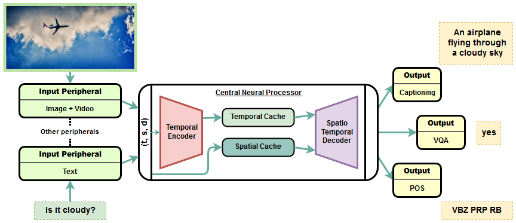
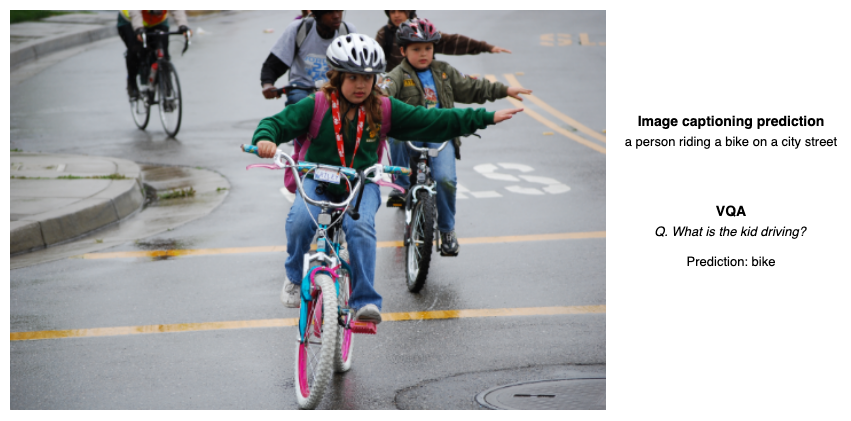
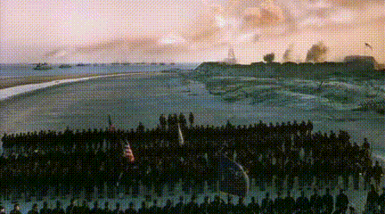
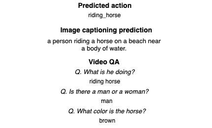

# OmniNet: A unified architecture for multi-modal multi-task learning

[](https://opensource.org/licenses/Apache-2.0)

*OmniNet* is a unified and extended version of the Transformer architecture for multi-modal multi-task learning. A single OmniNet architecture can encode multiple inputs from almost any real-life domain (text, image, video) and is capable of asynchronous multi-task learning across a wide range of tasks. The *OmniNet* architecture consists multiple sub-networks called the neural peripherals, used to encode domain specific inputs as spatio-temporal representations, connected to a common central neural network called the Central Neural Processor (CNP). The CNP implements a Transformer based universal spatio-temporal encoder and a multi-task decoder. 

This repository contains the official Pytorch implementation for <a href="https://arxiv.org/abs/1907.07804">OmniNet: A unified architecture for multi-modal multi-task learning</a> (Pramanik et al). The paper demonstrates a single instance of *OmniNet* jointly trained to perform the tasks of part-of-speech tagging, image captioning, visual question answering and video activity recognition. We also open source the pre-trained models to be able to reproduce the results demonstrated in the paper.

<p align="center">

</p>

## Setup

**Requirements**
- Minimum hardware: 8GB RAM + NVIDIA GPU (8GB+)
- Linux based OS
- NVIDIA driver 410+
- [Anaconda Package Manager](https://anaconda.org/)
- rest will be installed by anaconda (see below)

**Installation**
1. Clone the repo.
2. Create & activate an environment using the provided file. (This will install all required dependencies including cuda and cudnn)
```
$ conda env create -f environment.yml
$ source activate omninet
```

**Download datasets**

A download script has been provided to download and preprocess all training and test data for all tasks (except PENN POS tagging) mentioned in the paper. The downloaded data is stored in /data folder. 

```
$ python scripts/init_setup.py
```
## Pretrained models

Pretrained models for the various single and multi-task models demonstrated in the paper can be obtained from the following URLs and can be used to evaluate the performance of the architecture or perform prediction on external data.

1. VQA: https://storage.googleapis.com/omninet/200k_vqa.zip
2. Captioning: https://storage.googleapis.com/omninet/280k_caption.zip
3. HMDB: https://storage.googleapis.com/omninet/11k_hmdb.zip
4. PENN: https://storage.googleapis.com/omninet/70k_penn.zip
5. VQA+HMDB+Captioning+PENN: https://storage.googleapis.com/omninet/all_15k.zip

## Training

The training script includes subroutines to train the model on the COCO Image captioning, VQA, HMDB action recognition, and PENN POS tagging. First, download all required datasets using `scripts/init_setup.py` as described above. The training script can be used to train both on a single task and asynchronously on multiple different tasks. It implements multi-GPU hogwild training to train a single model across multiple GPUs on multiple tasks. 

```
$ python train.py <no. of training iterations> <task list> <batch sizes> --n_gpus <no. of GPUs> \
--save_interval <save interval> --eval_interval <eval interval>
```

The list of possible supported tasks are `vqa`, `hmdb`, `caption` and `penn`. (The data downloader in init_setup.py, however, does not download datasets for PENN tagging and it is required to manually download and preprocess PENN POS tagging dataset to train the model for POS tagging.)

For example, to train the model on a single task of Visual Question Answering for 100000 iterations and batch size of 128, use:

```
$ python train.py 100000 vqa 128 --n_gpus 1 --save_interval 500 --eval_interval 500
```

To train the model asynchronously on multiple tasks specify the list of tasks and batch sizes separated by a comma. For example, to train a single model jointly on VQA, HMDB, and COCO captioning with batch sizes 128, 64, 128 across three GPUs use:

```
$ python train.py 100000 vqa,hmdb,caption 128,64,128 --n_gpus 3 --save_interval 500 --eval_interval 500
```
When training on multiple tasks together it is recommended to use a multi-GPU system, or reduce batch size for each task if you run out of GPU memory. 

## Evaluation

The evaluation script can be used to evaluate a pretrained model for any given task. To evaluate the architecture on any of the model file obtained from the above pretrained model URLs, extract the downloaded model zip file and use the script below:

```
$ python evaluate.py <task name> <path to model.pth file> --batch_size <batch size> 
```
Following `<task name>` are supported:
 - `vqa` : Calculates scores on VQA valid set
 - `hmdb` : Calculates accuracy on HMDB train/test split 1
 - `caption` : Calculates score on COCO valid set

## Prediction

The prediction script can be used to perform prediction on any external data for all the tasks mentioned in the paper and can also be used to perform zero-shot prediction on untrained tasks. The possible tasks are `vqa`, `hmdb`, `caption` and `penn`. The current prediction script only implements greedy decoding and we plan to implement beam search in the future for improved performance. Download and extract the pre-trained multi-model from the URL mentioned above.

```
$ wget https://storage.googleapis.com/omninet/all_15k.zip
$ unzip all_15k.zip
```
### Prediction on pre-trained tasks:



**POS tagging**
```
$ python predict.py model.pth penn --text "there is no dark side of the moon really, as a matter of fact its all dark"
POS tagging Prediction:  EX VBZ RB VBN IN DT NN IN NN PRP$ DT NN IN NN PRP$ DT JJ
```
**Image captioning**
```
$ python predict.py model.pth caption --image sample_data/kids-hand-signals.jpg 
Caption Prediction: a person riding a bike on a city street
```

**Visual Question Answering**
```
$ python predict.py model.pth vqa --image sample_data/kids-hand-signals.jpg --text "What is the kid driving?"
VQA Prediction: bike
```

**Video action recognition**
```
$ python predict.py model.pth hmdb --video sample_data/riding_horse.avi 
Action recognition prediction: ride_horse
```

### Prediction on untrained tasks (towards zero-shot ML):



Due to the shared multi-modal representation learning architecture of the Central Neural Processor, *OmniNet* can also be used for zero-shot prediction for tasks it was never trained on. For example, the multi-model architecture can also be used for video captioning and video question answering even though the model was never trained on those tasks. The results below demonstrate the results of video captioning and video QA on a sample horse riding video. (Note: Results of zero-shot learning are still experimental and not always meaningful)

**Video captioning**

The same prediction script can be used for video captioning. But instead of providing an image we provide a raw video file for prediction:

```
$ python predict.py model.pth caption --video sample_data/riding_horse.avi
Caption Prediction: a person riding a horse on a beach near a body of water.
```

**Video QA**
```
$ python predict.py model.pth vqa --video sample_data/riding_horse.avi --text "What is he doing?"
VQA Prediction: riding horse
```
```
$ python predict.py model.pth vqa --video sample_data/riding_horse.avi --text "Is there a man or a woman?"
VQA Prediction: man
```
```
$ python predict.py model.pth vqa --video sample_data/riding_horse.avi --text "What color is the horse?"
VQA Prediction: brown
```

## Authors
1. Subhojeet Pramanik (IBM Watson) <email@subho.in>
2. Priyanka Agrawal (IBM Research) <pagrawal.ml@gmail.com>
3. Aman Hussain (University of Amsterdam) <email@amanhussain.com>
4. Sayan Dutta <duttasayan.7@gmail.com>

## Citation
We welcome the research community to extend our work. If you find this code useful, please cite our paper: <a href="https://arxiv.org/abs/1907.07804">OmniNet: A unified architecture for multi-modal multi-task learning</a>
```
@ARTICLE{2019arXiv190707804P,
       author = {{Pramanik}, Subhojeet and {Agrawal}, Priyanka and {Hussain}, Aman},
        title = "{OmniNet: A unified architecture for multi-modal multi-task learning}",
      journal = {arXiv e-prints},
     keywords = {Computer Science - Machine Learning, Computer Science - Computation and Language, Computer Science - Computer Vision and Pattern Recognition, Computer Science - Neural and Evolutionary Computing, Statistics - Machine Learning},
         year = "2019",
        month = "Jul",
          eid = {arXiv:1907.07804},
        pages = {arXiv:1907.07804},
archivePrefix = {arXiv},
       eprint = {1907.07804},
 primaryClass = {cs.LG},
       adsurl = {https://ui.adsabs.harvard.edu/abs/2019arXiv190707804P},
      adsnote = {Provided by the SAO/NASA Astrophysics Data System}
}
```
